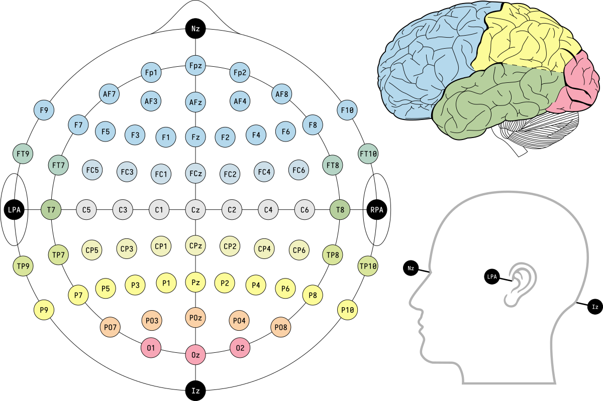

# neurothink

neurothink is project exploring Muse 2 EEG data.

## Eyes open/closed detection

[notebook](./EEG/Muse-EEG-eyes-open.ipynb)

In this notebook, I train a CNN to determine whether the wearer's eyes are open or closed based on the raw EEG signals. The results were surprising, with up to **82% accuracy** on my dataset.

Possible improvements:

- Use FFT data as additional features (ie. feature per band per sample). [example](https://www.kaggle.com/purplejester/pytorch-deep-time-series-classification)
- Use stationary wavelet transform, as a better (?) alternative to FFT.
- Experiment with network architectures.

## Direction detection

[notebook](./EEG/Muse-EEG-eyes-open.ipynb)

Here, I train a similar CNN to determine whether the wearer is thinking of the concept of `left`, `right`, or `neither`. **In Progress.**

## Meditation coach

Next, I plan on trying to training a network to detect different states of meditation, preferably with some notion of "meditation quality" baked into the training data and therefore the resulting network outputs.
